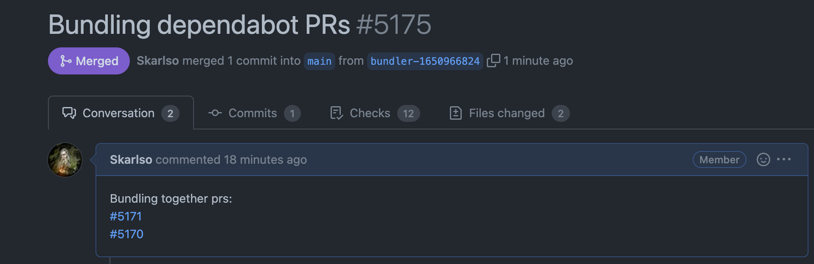

# Dependabot bundler

This is an action which can bundle together multiple Dependabot PRs for Go based Projects.

## Example Action

A simple example on how to use this action:

```yaml
- name: bundle-dependabot
  uses: skarlso/dependabot-bundler-action
  with:
    token: ${{ secrets.GITHUB_TOKEN }} # must have commit access and creating PR rights
    repo: ${{ github.event.repository.name }}
    owner: ${{ github.event.repository.owner }}
```

## Running it once a week

Bundler will gather all PRs which were created by `app/dependabot` user. Then, it will apply `go get -u` using the
modules in the prs that it found. Once all updates have been applied, it will create a commit and a PR.

Bundler only ever commits `go.mod` and `go.sum` files. It never stages any other changes.

```yaml
name: Dependabot Bundler

on:
  schedule:
    - 0 0 * * 5 # every Friday at 00:00

jobs:
  bundler:
    runs-on: ubuntu-latest
    steps:
      - name: Checkout
        uses: actions/checkout@v2
      - name: Setup Go
        uses: actions/setup-go@v2
        with:
          go-version: 1.18.x
      - name: bundle-dependabot
        uses: skarlso/dependabot-bundler-action
        with:
          token: ${{ secrets.GITHUB_TOKEN }} # must have commit access and creating PR rights
          repo: ${{ github.event.repository.name }}
          owner: ${{ github.event.repository.owner }}
```

If everything goes well, it should result in a PR like this:



## In Progress features

- [ ] define custom labels on the PR
- [ ] define custom description
- [ ] define custom title
- [ ] unit tests 
