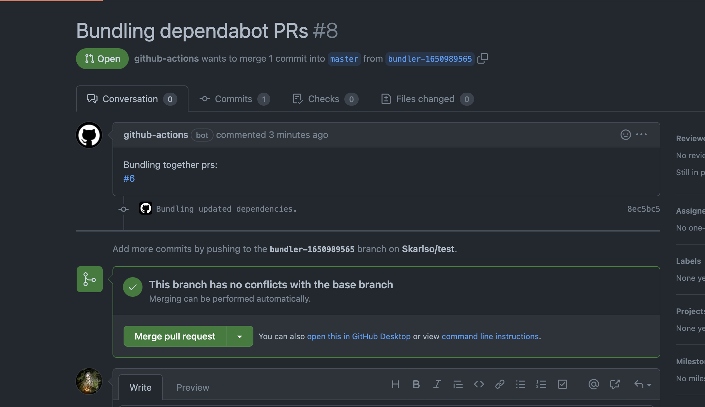
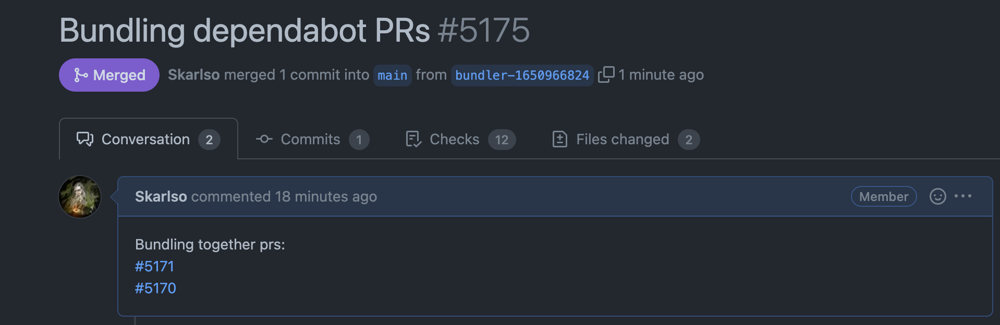

# Dependabot bundler

Bundler will gather all PRs which were created by `app/dependabot` user. Then, it will apply `go get -u` using the
modules in the prs that it found. Once all updates have been applied, it will create a single commit and a PR.

It doesn't attempt to merge PRs causing various merge conflicts. It will basically just do what dependabot would do
but apply it separately as a composite update.

Bundler only ever commits `go.mod` and `go.sum` files. It never stages any other changes.

Example running every Friday:

```yaml
name: Dependabot Bundler

on:
  schedule:
    - 0 0 * * 5 # every Friday at 00:00

jobs:
  bundler:
    runs-on: ubuntu-latest
    steps:
      - name: Checkout
        uses: actions/checkout@v2
      - name: Setup Go
        uses: actions/setup-go@v2
        with:
          go-version: 1.18.x
      - name: Cache go-build and mod
        uses: actions/cache@v2
        with:
          path: |
            ~/.cache/go-build/
            ~/go/pkg/mod/
          key: go-${{ hashFiles('go.sum') }}
          restore-keys: |
            go-          
      - name: Install Dependabot Bundler
        run: |
          go install github.com/Skarlso/dependabot-bundler@v0.0.3
      - name: Run Dependabot Bundler
-       run: |
          dependabot-bundler --token ${{ secrets.GITHUB_TOKEN }} --repo test --owner Skarlso
```

If everything goes well, it should result in a PR like this:



This is an actual PR located [here](https://github.com/weaveworks/eksctl/pull/5175) which was created with dependabot-bundler and merged.



## In Progress features

- [ ] define custom labels on the created PR
- [ ] define custom description
- [ ] define custom title
